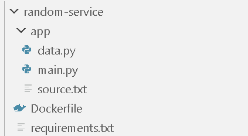

# CICD-Project
**cicd-project** - репозиторий, созданный в качестве образовательного материала для людей, которые начинают внедрять в свои проекты CI/CD.
Репозиторий имеет микросервис, который отправляет случайный факт о кошках и студии AuraStudio (моей студии)

## Структура проекта

На данном изображении продемонстрирована структура микросервиса в данном проекте.

## API Документация

**Адрес:** http://localhost:5090 (Данный репозиторий предназаначен для самостоятельного размещения на серверах)

**Ответы:**
1) Стандартный ответ - {"status": [status], "message": [message]}
2) Ответ с фактами - {"status": [status], "factCat": [fact], "factStudio": [fact]}

**Endpoints**
1) /random/status - статус микросервиса
2) /random/get - получение фактов
3) /random/information - информация о проекте

## CI/CD
В репозитории предствлен файл '.gitlab-ci.yml'. С помощью него происходит автоматическая сборка, тестирование и доставка обновления в продакшен.
**Шаги:**
1) Для работы с ним, вам необходимо зарегестрироваться в GitLab - https://gitlab.com. 
2) После этого, загружаете репозитоий
3) Заходите в Setting->CI/CD->Runners. 
4) Создаёте раннера и настраивайте его. Можно разместить на своём сервере или использовать раннеры других людей.
После всех манипуляций, при каждом коммите, будет запускаться pipeline, работающий на '.gitlab-ci.yml'.

Для подробного ознакомления, предоставляю ссылки на материал:
1) https://github.com/artemonsh/cicd_example (репозиторий, где подробно рассказывается, как запустить раннер)
2) https://youtu.be/prOarIqL5Qs?si=7qvKli48NACuIz36 ( Пишем реальный CI/CD пайплайн | GITLAB CI/CD на практике)
3) https://youtu.be/pFKwmEdwZZQ?si=TirStZNXyvgz23fU (CI/CD — Простым языком на понятном примере)